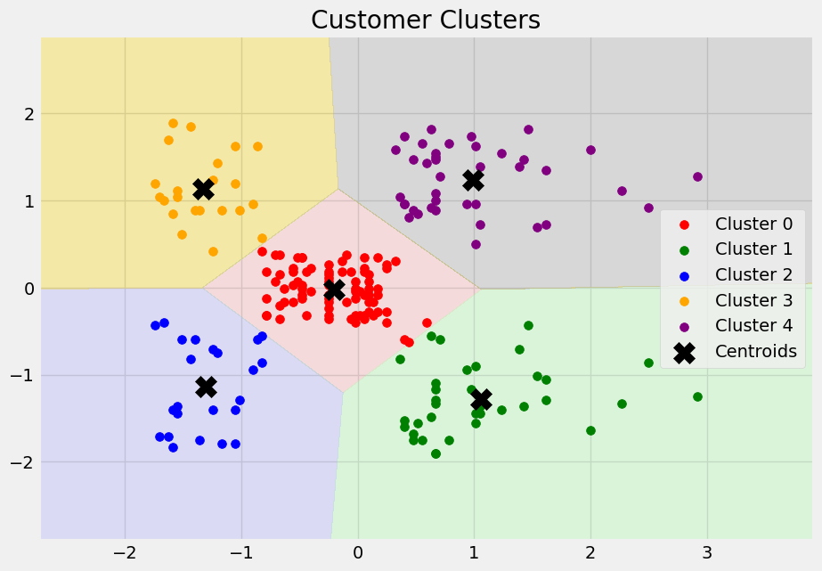
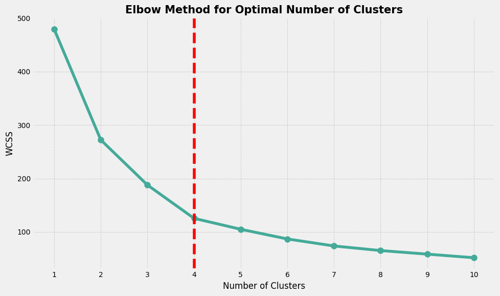

# Customer Clustering with KMeans and PCA

## Overview
This project demonstrates customer segmentation using KMeans clustering and PCA (Principal Component Analysis). The goal is to analyze customer data to identify distinct segments based on purchasing behavior.

## Context
This dataset is known as market basket analysis. I will demonstrate this using the unsupervised machine learning technique (KMeans Clustering Algorithm) in its simplest form.

## Content
You own a supermarket mall and, through membership cards, you have some basic data about your customers, including Customer ID, age, gender, annual income, and spending score. The Spending Score is a value assigned to the customer based on defined parameters like customer behavior and purchasing data.

## Problem Statement
As the mall owner, you want to understand your customers better, specifically identifying those who can be easily targeted (Target Customers). This understanding will help the marketing team devise effective strategies.

## Output Examples
Here are some output charts generated from the analysis:

